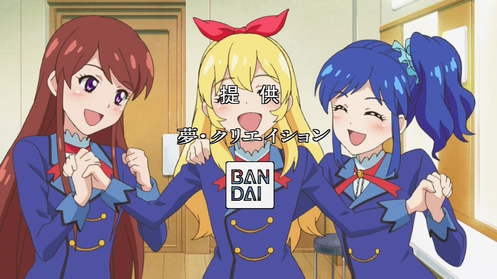

[](https://github.com/MakeNowJust/sushi-ware)

# TeikyoGenerator
"提供目"(Teikyo-me) is japanese traditional funny picture for TV captured things.

Japanese TV has fund provider. And japanese TV maker introduce the company for appreciation. So sometimes that caption be coverd with some people eyes.

ex)


This repository generate this "提供目".

## Installation
To install Teikyo generator, you need to install Go and Go workspaces.

And to enable Face API in Azure.

https://azure.microsoft.com/ja-jp/services/cognitive-services/face/

1. `go get` this repository
    ```
        $ go get github.com/hatobus/Teikyo
    ```

2. To write `.env` file
    .env file is like this
    ```
        URL=[Your request URL with Azure]
        KEY1=[Azure Key1]
        KEY2=[Azure Key2]
    ```
3. To start `server.go`
   ```
        go run server.go
   ```
   Default port is `8080`. If it already used. To change other ports.
4. Do POST Request
   
   - curl
        ```
            curl http://localhost:8080/detect \ 
            -F "upload[]=@path/to/img1.jpg" \
            -F "upload[]=@path/to/img2.jpg" \
            -H "Content-Type: multipart/form-data"
        ```
   - httpie
        ```
           http -f POST http://localhost:8080/detect \
           upload[]@/path/to/img1.jpg \
           upload[]@/path/to/img3.jpg
        ```
    
    Source image must be `jpeg` file. (Other format will be error)

5. To generate pictures
    
    Output image generate to `picture/output` and name is `output[num].png`

    example

    

## Used
- Azure 
    - FaceAPI
- Golang
    - godotenv
    - gin


